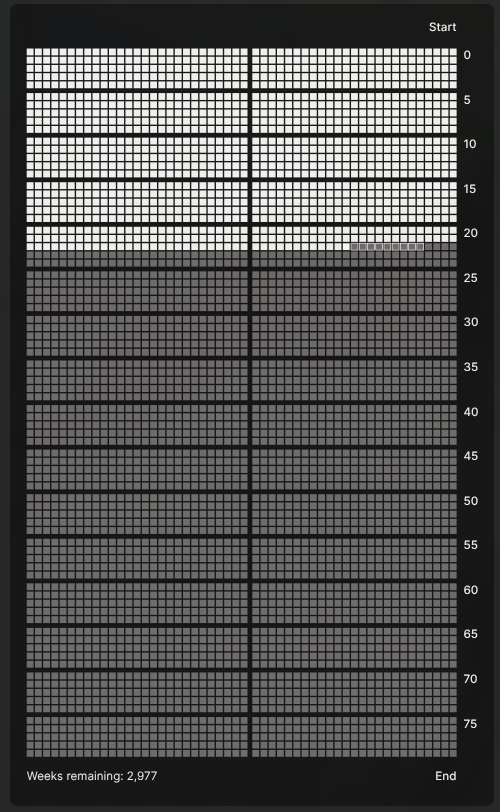

# Memento Mori - Obsidian Plugin

Visualize your life in weeks with a beautiful, interactive life calendar. This plugin brings the powerful memento mori concept to Obsidian, helping you stay mindful of time and focused on what truly matters.



## Features

- **Life Grid Visualization**: See your entire life as a grid of weeks (52 weeks × N years)
- **Events & Goals**: Track important dates and multi-week projects with hover tooltips
- **Weekly Statistics**: View notes created and words written per week (optional)
- **Theme Integration**: Automatically adapts to your Obsidian theme (light/dark modes)
- **Flexible Display**: View as sidebar panel or embed in notes with code blocks

## Installation

### From Obsidian Community Plugins

Settings → Community Plugins → Search "Memento Mori" → Install

### Manual Installation

Copy `main.js`, `manifest.json`, and `styles.css` to `<vault>/.obsidian/plugins/memento-mori/`

## Quick Start

1. Set your birthdate in **Settings → Memento Mori** (YYYY-MM-DD format)
2. Click the **skull icon** in the ribbon or use command palette: "Open Memento Mori view"
3. Add events and goals in the settings panel

## Usage

### Sidebar View

The calendar opens in the left sidebar by default. Click the skull icon or use the command palette to open it.

### Code Block Embedding

Embed a life calendar in any markdown note:

````markdown
```memento-mori
birthdate: 1990-01-01
years: 80
showStats: true
events:
  - date: 2010-06-15
    title: Graduated High School
  - date: 2020-03-15
    title: Started Dream Job
goals:
  - startDate: 2024-01-01
    endDate: 2024-12-31
    title: Learn TypeScript
```
````

**Note**: Events use `date` and `title` fields; goals use `startDate`, `endDate`, and `title`. The `id` field is auto-generated.

## Settings

### Core
- **Birthdate** (required): YYYY-MM-DD format
- **Years to display**: Grid height (default: 80)

### Layout
- **Box size**: Week box size in pixels (5-20)
- **Spacing**: Gap between boxes (0-10px)
- **Margin**: Grid padding
- **Years per group**: Visual gaps every N years (default: 5)

### Features
- **Show statistics**: Age and weeks lived/remaining panel
- **Show weekly stats**: Notes/words in tooltips (requires vault scan)
- **Highlight current year**: Highlight your current age row
- **Expected lifespan**: Draw line at expected age

### Appearance
- **Colors**: Automatically adapt to your Obsidian theme
- **Customization**: Override individual colors in settings
- **Start/End labels**: Toggle year labels

---

Inspired by [memento-mori](https://nor-git.pages.dev/memento-mori/) by [nor-nor](https://nor-blog.pages.dev/)

Licensed under [MIT](LICENSE)
